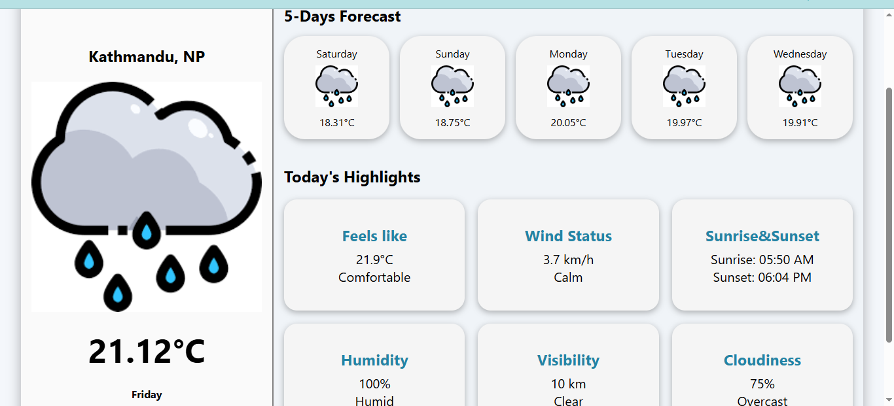

# Weather Web App
## Name: SkyCast
## Link: [Live Page](https://sky-cast-beige.vercel.app/)

A simple weather dashboard made using **HTML, CSS and JavaScript**.
It allows user to find the weather/temperature of their location along 
with some extra details like wind status, humidity and also future forecast
upto 5 days.

## Features
- Search up your location
- Get the current temperature as well as future
- Also view the extra details like wind status, visibility, humidity and so on

## Preview


## Technologies used
- HTML
- CSS
- JavaScript(Vanilla JS)

## Installation 
1. Clone this repository:
    ```bash
    git clone https://github.com/Amrit126/SkyCast.git

2. Open the project folder:
    cd SkyCast

3. Open index.html in your browser.

## Usage
1. Type a city name in the search bar.
2. Click the search button.
3. View the current weather and 5-day forecast.

## Author
    Name: Amrit Paudel